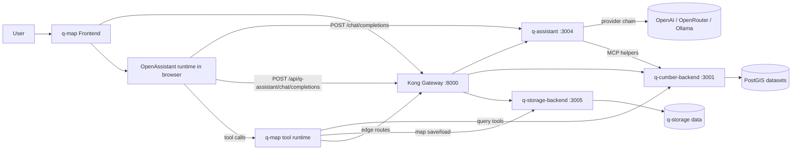
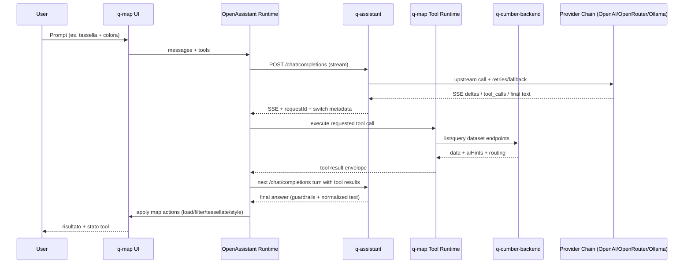
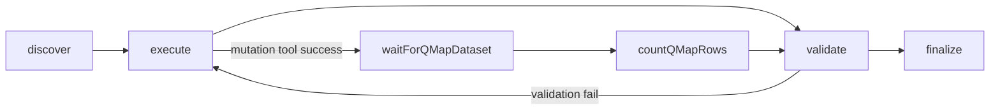
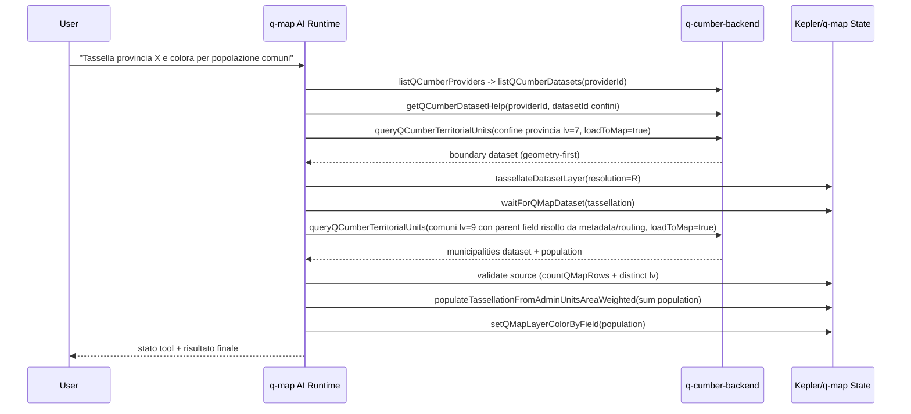
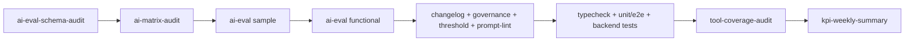

# Q-Map Architecture Documentation

## Scope
This document explains architectural choices for `examples/q-map`, including:
- q-map UI extension strategy over Kepler
- backend topology and responsibilities
- AI agent/tool runtime behavior
- operational guardrails, observability, and testing
- change-tracking discipline via `examples/q-map/CHANGELOG.md` (`Unreleased` before commit)

It is the technical reference for implementing features without breaking Kepler compatibility.

## Design Principles
- Keep Kepler core untouched: prefer composition/injection under `examples/q-map/*`.
- Separate concerns: dataset query != map persistence != AI proxy.
- Deterministic AI execution: explicit tool chaining, stable dataset references, low ambiguity.
- Geometry-first geospatial workflows: avoid heuristic point fallback unless explicitly requested.
- Production-safe defaults: retries, timeouts, and auditability.

## High-Level Topology
- Frontend: `examples/q-map` (Vite + React + Redux + Kepler embedding).
- Backend services (Docker Compose in `examples/q-map/backends`):
  - `kong` (`:8000`): default edge API gateway for JWT validation/rate-limit before backend access.
  - `q-cumber-backend` (`:3001`): read-only PostGIS dataset/provider query gateway.
  - `q-storage-backend` (`:3005`): map persistence backend.
  - `q-assistant` (`:3004`): AI proxy + MCP endpoint + helper tools.
  - compose services use `restart: unless-stopped` for safer auto-recovery on transient process exits.
- Backend persistent data is stored on local bind mounts:
  - `examples/q-map/backends/q-cumber-postgis/data`
  - `examples/q-map/backends/q-storage-backend/data`



### Gateway Integration (Default)

Default local stack runs with Kong overlay (`examples/q-map/backends/docker-compose.kong.yaml`):
- q-map AI endpoint should point to gateway route:
  - `VITE_QMAP_AI_PROXY_BASE=http://localhost:8000/api/q-assistant`
- backend routes exposed by gateway:
  - `/api/q-assistant/*`
  - `/api/q-cumber/*`
  - `/api/q-storage/*`
- declarative Kong policy source:
  - `examples/q-map/backends/kong/kong.yml`
  - rendered from env via `make -C examples/q-map/backends render-kong-config` (primary/secondary JWT issuer+secret rotation slots + issuer/audience pre-checks).
- UX bearer propagation to Kong is supported by default:
  - runtime token: `QMAP_AUTH_RUNTIME_TOKEN=<jwt>`
  - runtime token lookup keys (`sessionStorage/localStorage`): `VITE_QMAP_AUTH_TOKEN_STORAGE_KEYS` (default includes `qmap_gateway_jwt`, `qmap_auth_token`, `qmap_access_token`)
- direct backend bypass is available only for debug/fallback (`make -C examples/q-map/backends up-direct`).

### Swarm Deployment Option (Prod)

For Swarm-mode production deployment, use:
- `examples/q-map/backends/docker-stack.prod.yml`
- `examples/q-map/backends/.env.prod.example`

Design choices in this stack:
- Kong is the only published edge service (default port `8000`).
- q-assistant/q-cumber/q-storage/PostGIS remain on internal overlay network.
- Healthchecks + restart/update policies are defined at service level (no startup ordering dependency on `depends_on`).
- Runtime secrets are consumed via Docker Swarm `secrets` mounts with shell bootstrap export in Python services.

## Frontend Architecture (q-map over Kepler)
q-map extends Kepler through injection and wrappers, not by modifying root `src/*`.

Key integration points:
- Entry and composition: `examples/q-map/src/main.tsx`
- Custom UI components: `examples/q-map/src/components/*`
- AI runtime wrapper: `examples/q-map/src/features/qmap-ai/qmap-ai-assistant-component.tsx`
- q-map cloud/query tools: `examples/q-map/src/features/qmap-ai/cloud-tools.tsx`
- AI tool category introspection: `examples/q-map/src/features/qmap-ai/tool-registry.ts`
- AI grouped registry composer (+ duplicate-key guard): `examples/q-map/src/features/qmap-ai/tool-groups.ts`
- Draw runtime helpers: `examples/q-map/src/features/qmap-draw/runtime.ts`
- Draw middleware orchestration: `examples/q-map/src/features/qmap-draw/middleware.ts`
- Prompt policy: `examples/q-map/src/features/qmap-ai/system-prompt.ts`
- H3 engine: `h3-js` v4 (imported as `h3-js-v4`); only v4 API names are used (`latLngToCell`, `cellToLatLng`, `polygonToCells`, etc.).
  - TypeScript typings for the alias are re-exported from `h3-js` in `src/types/h3-js-v4.d.ts`.

Important injected capabilities:
- Custom panel/header/sidebar branding (`q-hive`).
- Custom load-data UX (including URL import flow).
- Geometry context actions (H3 tessellation).
- q-map-specific map controls and layer operations.

## AI Runtime Architecture
### Runtime model
- UI uses OpenAssistant runtime in embedded panel.
- q-map frontend sends OpenAI-compatible requests to `q-assistant` (`POST /chat/completions`).
- Provider/model fallback selection is handled server-side by q-assistant chain configuration.
- Toolset is a merge of:
  - base Kepler/OpenAssistant tools
  - q-map custom tools for dataset inspection, H3, styling, clipping, joins, reprojection, etc.



### Assistant turn-state schema


### Determinism and chaining
- Prefer explicit `datasetRef` (`id:<datasetId>`) returned by `listQMapDatasets`.
- q-cumber provider flow is strict:
  1. `listQCumberProviders`
  2. `listQCumberDatasets(providerId=...)`
  3. `getQCumberDatasetHelp(providerId=..., datasetId=...)`
  4. query using `routing.queryToolHint.preferredTool`:
     - `queryQCumberTerritorialUnits` for administrative datasets
     - `queryQCumberDatasetSpatial` for thematic geometry datasets
     - `queryQCumberDataset` as fallback
- Explicit `providerId` is recommended for determinism; when omitted, runtime auto-select is allowed only for uniquely resolvable catalogs (single provider), otherwise it fails fast and requires explicit provider selection.
- If `providerId` is explicitly provided and invalid/unavailable, runtime must fail fast (clear error + available provider ids) and must not silently fallback to another provider.
- Explicit `datasetId` must be an exact catalog id from `listQCumberDatasets(providerId)`; runtime no longer resolves dataset names/fuzzy aliases and fails fast on invalid ids with available dataset hints.
- `queryQCumberTerritorialUnits` is strict by contract: if dataset metadata is non-administrative, it returns a structured retry directive (suggested tool + args) instead of in-tool semantic fallback.
- Runtime orchestration can execute one automatic retry from that directive (for resilience), and writes retry trace in tool details/audit (`autoRetry`).
- Tool-space introspection is category-aware: call `listQMapToolCategories` and `listQMapToolsByCategory(categoryKey)` when routing is ambiguous to constrain execution to one functional class at a time.
- Turn-scoped tool gating is enforced in q-map runtime before tool execution:
  - default scope is `balanced` (`VITE_QMAP_AI_TOOL_SCOPE=balanced`) and derives a per-turn allowlist from user text + functional categories;
  - fallback scope `full` (`VITE_QMAP_AI_TOOL_SCOPE=full`) keeps all available tools.
  - blocked tool calls fail deterministically with a policy message instead of silent fallback.
- **Backend state-machine transitions** enforce deterministic workflow routing via `tool_choice`:
  - `discovery → query`: after `listQCumberProviders` + `listQCumberDatasets` both succeed with no query tool called, backend forces `getQCumberDatasetHelp` or `queryQCumberTerritorialUnits`.
  - Additional transitions (query→area, area→rank) can be added in `runtime_loop_limit_rules.py` following the `build_post_discovery_force_query_decision` pattern.
  - Architecture follows Anthropic's "Building Effective Agents" recommendation: deterministic code controls transitions, LLM handles reasoning within each step.
- **Frontend FIFO serialization**: all tool calls go through `AsyncMutex` one at a time (tool-pipeline.ts), compensating for providers that ignore `parallel_tool_calls=false`. Per-tool circuit breaker (max 3 calls per user message) prevents local-only tool loops.
- Turn execution state machine is hard-enforced in q-map runtime:
  - phases: `discover -> execute -> validate -> finalize`;
  - each turn captures a pre-flight dataset snapshot (discovery equivalent); `listQMapDatasets` remains explicit refresh/discovery tool;
  - dataset snapshot staleness is enforced with TTL (`VITE_QMAP_AI_TURN_SNAPSHOT_TTL_MS`, default `180000ms`);
  - `waitForQMapDataset` blocks ambiguous/unmaterialized non-canonical names and requires `id:<datasetId>` when needed.
- Runtime progress is surfaced deterministically from tool events (not only model prose):
  - live panel in assistant UI shows `running/done/failed/blocked` per tool call and current request id;
  - final assistant message is prefixed with `[requestId: ...]` and a compact `[progress]` summary.
  - final assistant message also includes a machine-readable envelope `[executionSummary] {...}` for deterministic downstream parsing.
  - fail-closed post-response check: if text claims centering/zoom but no successful `fitQMapToDataset` tool evidence exists, q-map strips those claim lines and injects `[guardrail] centering_claim_blocked ...`.
- Hard dataset post-validation is runtime-enforced for mutating geospatial tools:
  - after successful mutation tools, runtime automatically runs `waitForQMapDataset` then `countQMapRows` on the target dataset;
  - validation failure marks runtime step as failed (including zero-row outputs), independent of model narrative.
- Chart rendering tools are runtime-policy gated (`safe`/`full`/`timeseries-safe`); custom charts (`categoryBarsTool`, `wordCloudTool`) are always available, while base ECharts tools are exposed when present in the active base runtime.
- `expectedAdminType` guardrails apply only to administrative queries; thematic spatial flows (`queryQCumberDatasetSpatial`) must ignore admin-level constraints to avoid invalid `lv` filtering on thematic schemas (e.g. CLC).
- `expectedAdminType` input is normalized for bilingual mixed forms (for example `municipality/comune`, `province/provincia`) to canonical values before validation, avoiding avoidable tool-arg hard failures.
- For large thematic land-cover datasets (CLC/corine), avoid direct `tassellateDatasetLayer` on source polygons; prefer `aggregateDatasetToH3` with class grouping (`code_18`, optional class labels) to reduce timeout risk and keep category semantics.
- For H3 tessellation + thematic overlays, prefer H3-native flows (`aggregateDatasetToH3` -> `joinQMapDatasetsOnH3`) instead of clipping full thematic polygon datasets against H3 cells.
- For named-boundary thematic outputs (e.g. "boschi in Veneto"), enforce deterministic exact-perimeter sequence: boundary tessellation (left) -> thematic aggregate to H3 (right) -> `joinQMapDatasetsOnH3` (left join) -> final `clipQMapDatasetByGeometry` against boundary polygon.
- In `joinQMapDatasetsOnH3`, numeric right fields follow selected numeric metric, while categorical/thematic fields are preserved with categorical-safe output (no class-label averaging).
- `clipQMapDatasetByGeometry` supports GeoJSON or H3 sources (`h3_id`/`h3__id`), while clip datasets must expose GeoJSON polygons.
- Clip workflows can emit per-row diagnostics fields for analysis chaining: `qmap_clip_match_count`, `qmap_clip_intersection_area_m2`, `qmap_clip_intersection_pct`.
- Clip workflows can also emit `<clip_field>__count` fields with distinct clip-side value counts per output row.
- With `includeDistinctPropertyValueCounts=true`, clip workflows can also emit `<clip_field>__<value>__count` fields with matched clip-side row counts for each value.
- Geometry-analysis tools also support H3 inputs (`h3_id`/`h3__id`) where applicable: `spatialJoinByPredicate`, `zonalStatsByAdmin`, `overlayDifference`, `bufferAndSummarize`, `nearestFeatureJoin`, `coverageQualityReport`, `adjacencyGraphFromPolygons`.
- `zonalStatsByAdmin` runtime mode selection:
  - H3 fast-path when both inputs expose H3 fields at aligned resolution (cell-key join/aggregation, avoids heavy geometry intersections).
  - Geometry mode otherwise (`intersects|centroid|area_weighted`) runs worker-first and falls back to local computation only below budget threshold; above threshold it fails fast before UI freeze risk.
- For administrative child queries, if generic `parent_id` is rejected by backend, q-map query runtime retries once by rewriting to backend candidate parent fields from routing/aiProfile hints before failing.
- For child administrative queries, parent filter fields must be resolved from dataset metadata/routing candidates (for example `kontur_boundaries__lv4_id`), not hardcoded to generic `parent_id`.
- For thematic spatial queries with auto-injected `spatialBbox` (for example local-assets-it Italy default bbox), when the first `loadToMap=true` query returns `totalMatched=0` and no user filters are present, q-map retries once without `spatialBbox` before returning empty output.
- q-assistant runtime applies two defensive schema guardrails before upstream calls:
  1. `tableTool` / `mergeTablesTool` are always pruned from advertised tools.
  2. when repeated discovery-only loops are detected (`listQCumberProviders`/`listQCumberDatasets` with no progress), redundant discovery tools are temporarily pruned to force progression to query/clarification.
- Disabled/pruned generic SQL/table/spatial-legacy tools are intentional: they can skip q-map geospatial quality gates (level constraints, coverage checks, and deterministic workflow sequencing), increasing analytical bias and reducing reproducibility.
- Mode-level allowlists are now explicit:
  - `kepler`: full capability set (subject to turn-scoped gating).
  - `draw-stressor`: constrained geospatial/H3/styling workflow tools.
  - `draw-on-map`: local draw/H3/styling-focused subset (no broad discovery/query surface).

### Geometry-first loading policy
- `queryQCumberDataset(loadToMap=true)` auto-selects geometry fields first.
- `queryQCumber*` tool calls are full-schema: `select` is intentionally not part of q-map runtime tool parameters, so backend datasets retain all properties.
- Lat/lon -> point inference is explicit:
  - `inferPointsFromLatLon=true` per call, or
  - env override `VITE_QMAP_AI_QUERY_INCLUDE_LATLON_FALLBACK=true`
- Auto layer creation is conditional on renderable geometry presence.

Rationale:
- Prevent unwanted `Point` layers for boundary datasets.
- Keep administrative workflows stable (tessellation, clipping, population transfer).

### Prompt policy
- System prompt includes deterministic recipes for administrative/H3 flows.
- Explicit constraints prevent fragile heuristics (e.g. forbidden name-contains for province membership).
- Ranking policy enforces safe metrics: avoid geometry/identifier fields for `orderBy` unless explicitly requested; fallback resolution should prefer semantic numeric candidates exposed by metadata (`routing.orderByCandidates`, `aiHints.orderByCandidates`).
- Off-map ranking (`loadToMap=false`) is reserved for list/text-only answers; map display/transform workflows must run with `loadToMap=true` before map operations.
- Prompt biases toward:
  - context discovery
  - validation
  - transform/aggregate
  - styling/fit
  - concise status reporting

### Critical Workflow: Boundary -> H3 -> Population -> Style


## Backend Architecture
### `q-cumber-backend`
Role:
- Catalog and query datasets via provider descriptors backed by PostGIS tables (`source.type=postgis`).
- Return normalized query payloads plus AI hints and backend routing metadata for agent guidance.

Non-goals:
- map persistence
- remote provider federation/orchestration
- direct AI model orchestration

Current mode:
- PostGIS-only runtime for dataset queries. Remote source types (`ckan`, `esri`, `geoapi`, `wfs`, `q-cumber API`) are disabled.
- Legacy provider descriptors are archived under
  `examples/q-map/backends/q-cumber-backend/provider-descriptors`.

### `q-storage-backend`
Role:
- Read/write cloud maps for user persistence workflows.

Non-goals:
- dataset federation/query logic

### `q-assistant`
Role:
- Provider-agnostic LLM proxy (`/chat`, `/chat/completions`).
- q-map frontend path: `/chat/completions` (stream-compatible for OpenAssistant runtime).
- `/chat` remains a non-streaming JSON endpoint for direct integrations/tests.
- Retry/fallback chain across models/providers.
- MCP server endpoint (`/mcp`) + q-map helper operations.
- Optional runtime context injection for map state.
 - q-map frontend does not set provider/model; orchestration is server-side via q-assistant.

Key controls:
- explicit tool routing toggle
- q-map context injection toggle
- runtime objective anchoring (`[OBJECTIVE_ANCHOR]` + `[OBJECTIVE_CRITERIA]`) before token-budget compaction
- non-stream assistant final-text normalization: strips leaked objective-anchor instruction lines from provider output and enforces a single deterministic `Copertura obiettivo:` line when objective focus terms are available
- runtime step guardrails (`[RUNTIME_GUARDRAIL]` / `[RUNTIME_NEXT_STEP]`) derived from latest tool outcomes (dataset-create/update flows require `waitForQMapDataset` then `countQMapRows`; final validated outputs require `showOnlyQMapLayer`; low-distinct color failures block same-args retries)
- runtime metric-field recovery guardrail: when ranking fails with `metric field not found`, force dataset-field inspection (`previewQMapDatasetRows`) and retry ranking on an existing numeric metric field
- runtime ranking-evidence guardrail: for superlative/ranking objectives, final response must include ordered evidence from `rankQMapDatasetRows` (name + metric), not generic narrative only
- runtime tie guardrail: when ranking metric is flat (`distinct=1`), response must explicitly report ties instead of unique top/bottom claims
- runtime chart-evidence guardrail: `categoryBarsTool` on `name` without a metric axis is not accepted as ranking evidence
- for "problemi/pressione ambientale" objectives, guardrails block silent fallback to population/name metrics unless explicitly requested
- runtime centering-evidence guardrail: for objectives asking centering/zoom, assistant must not claim "mappa centrata" when `fitQMapToDataset` failed or no successful fit evidence exists
- runtime turn-state loop guardrail: repeated `Hard-enforce turn state: discovery step is mandatory` failures prune failing operational tool retries and force recovery through `listQMapDatasets`
- runtime guardrail selection is weighted (`Selected rule <ruleId> (score=<n>)`) so competing notes are ranked instead of first-match hardcoded branching
- runtime guardrail for cached routing/isochrone datasets: if `waitForQMapDataset`/`countQMapRows` fails with dataset-not-found right after a successful `isochrone`, q-assistant instructs deterministic recovery `saveDataToMap -> waitForQMapDataset -> countQMapRows` (avoid rerunning `isochrone` unless save fails)
- upstream retry/backoff configuration
- request timeout

## Observability and Audit
q-assistant supports append-only JSONL chat audit logs.

Main capabilities:
- per-request `requestId`
- per-session audit split via `sessionId`
- endpoint, status, latency
- selected provider/model and fallback attempts
- per-attempt upstream retry trace (`upstreamRetryTrace`) including status/error and backoff sleep timing
- requested tools and response tool-calls (when available)
- sanitized payload snapshots (sensitive fields redacted)
- per-request workflow quality diagnostics (`qualityMetrics`):
  - `postCreateWaitOk`, `postCreateWaitCountOk`
  - `finalLayerIsolatedAfterCount`, `pendingIsolationAfterCount`
  - `waitTimeoutCount`, `falseSuccessClaimCount`, `workflowScore`
  - `falseSuccessClaimRules` (debug rules explaining which contradictory-claim checks were triggered)

Headers used for traceability:
- response: `x-q-assistant-request-id` (returned by `/chat`, `/chat/completions`)
- request: `x-q-assistant-session-id` (sent by q-map frontend; one id per browser tab/session)

Audit file layout:
- directory: `examples/q-map/backends/logs/q-assistant/chat-audit`
- one JSONL file per session id: `session-<sessionId>.jsonl`
- fallback file when session header is missing: `session-default.jsonl`

Compose integration:
- host path: `examples/q-map/backends/logs/q-assistant`
- container path: `/var/log/q-assistant`

Relevant env:
- `Q_ASSISTANT_CHAT_AUDIT_ENABLED`
- `Q_ASSISTANT_CHAT_AUDIT_LOG_PATH`
- `Q_ASSISTANT_CHAT_AUDIT_INCLUDE_PAYLOADS`
- `Q_ASSISTANT_CHAT_AUDIT_INCLUDE_CONTEXT`
- `Q_ASSISTANT_UPSTREAM_RETRY_ATTEMPTS`
- `Q_ASSISTANT_UPSTREAM_RETRY_BASE_DELAY`
- `Q_ASSISTANT_UPSTREAM_RETRY_MAX_DELAY`
- `Q_ASSISTANT_UPSTREAM_RETRY_JITTER_RATIO`
- `Q_ASSISTANT_UPSTREAM_RETRY_TIMEOUT_INCREMENT`

Default in this project is debug audit ON with payloads and context excluded by default (`Q_ASSISTANT_CHAT_AUDIT_ENABLED=true`, `Q_ASSISTANT_CHAT_AUDIT_INCLUDE_PAYLOADS=true`, `Q_ASSISTANT_CHAT_AUDIT_INCLUDE_CONTEXT=false`).
If needed for privacy or lower log volume, override with:
- `Q_ASSISTANT_CHAT_AUDIT_ENABLED=false`
- `Q_ASSISTANT_CHAT_AUDIT_INCLUDE_CONTEXT=false`

## Reliability Patterns
- Frontend query timeout for q-cumber (`VITE_QCUMBER_BACKEND_TIMEOUT_MS`).
- q-assistant upstream retries with exponential backoff + jitter for transient `429/5xx/network` failures.
- q-assistant effective upstream timeout is extended by retry policy:
  - `effective_timeout = Q_ASSISTANT_TIMEOUT + (Q_ASSISTANT_UPSTREAM_RETRY_TIMEOUT_INCREMENT * Q_ASSISTANT_UPSTREAM_RETRY_ATTEMPTS)`
- Icon-layer remote SVG icons fetch is disabled by default in q-map (`VITE_QMAP_DISABLE_REMOTE_SVG_ICONS=true`) to avoid intermittent browser CORS errors from external CDN; set to `false` to restore remote icon catalog fetch.
- Guardrails for async dataset creation (`waitForQMapDataset` before downstream actions).
- Assistant turn-state guardrails enforce per-turn dataset snapshot capture and require snapshot refresh on TTL expiration (`VITE_QMAP_AI_TURN_SNAPSHOT_TTL_MS`).
- Coverage thresholds for H3 joins/population transfer.
- Worker-first heavy geometry operations with local fallback where applicable.
- Source-layer auto-hide is enabled for derived workflows (`aggregateDatasetToH3`, `joinQMapDatasetsOnH3`, `clipQMapDatasetByGeometry`, `populateTassellationFromAdminUnits*`) to reduce clutter/freezes when technical intermediates are present.
- q-cumber query pagination for map loads: `queryQCumberDataset*` auto-pages `limit/offset` windows when `loadToMap=true` and `totalMatched > returned` (including over backend per-request cap).
- Render-resilient long jobs: `aggregateDatasetToH3`, `populateTassellationFromAdminUnits*`, `clipQMapDatasetByGeometry`, `spatialJoinByPredicate`, `zonalStatsByAdmin`, `overlayDifference`, `bufferAndSummarize`, `nearestFeatureJoin`, `adjacencyGraphFromPolygons` use guarded async execution and cooperative yielding so assistant rerenders/unmounts do not leave stale writes and UI freeze risk is reduced.
- `aggregateDatasetToH3` and `populateTassellationFromAdminUnits*` run worker-first for GeoJSON + `area_weighted` paths even on small row counts, to avoid main-thread stalls on small-but-complex polygon geometries.
- `clipQMapDatasetByGeometry` applies adaptive defaults on large workloads: diagnostics fields (`qmap_clip_*`, `<prop>__count`) are auto-disabled unless explicitly requested, prioritizing deterministic completion over expensive per-row metrics.
- `waitForQMapDataset` treats clip outputs as heavy materializations and uses longer baseline waits for `clip` datasets to reduce false timeout/retry loops while processing is still active.
- `zonalStatsByAdmin` geometry-mode budget is configurable via `VITE_QMAP_AI_ZONAL_MAX_LOCAL_PAIR_EVAL` (default `600000`; internally stricter for `area_weighted`).
- Runtime UI guardrail for malformed color ranges.

## Security Posture
- Never store provider keys in frontend `VITE_*` variables.
- Keep secrets in backend env (`Q_ASSISTANT_API_KEY`, provider-specific keys).
- In local `openrouter` mode, set `OPENROUTER_API_KEY` or `Q_ASSISTANT_API_KEY` in `examples/q-map/backends/.env` before running ai-eval/KPI loops; gateway `/health` readiness alone does not validate upstream LLM credentials.
- Audit logs redact common secret-bearing fields.
- q-cumber backend is read-only by design for data access.
- Default hardened edge: Kong gateway (`examples/q-map/backends/docker-compose.kong.yaml`) enforces JWT before reaching q-assistant/q-cumber/q-storage routes.
- Frontend request paths (`/chat`, `/mcp`, `/me`, cloud-provider calls) now share one bearer-token resolver to keep UX/backend auth alignment deterministic in Kong mode.
- Full production hardening remains in TODO K3: issuer/audience enforcement at gateway and claim-to-role authorization in backend services.

## Testing Strategy
- Playwright E2E is split into:
  - UX/functional suite (`playwright.ux.config.ts`): `smoke.spec.ts`, `ux.spec.ts`, `ux-regression.spec.ts`, `tools.spec.ts`
  - assistant interaction suite (`playwright.assistant.config.ts`): `ai-mode-policy.spec.ts`
- Assistant interaction suite is deterministic and configured serial + retry (`workers: 1`, `retries: 1`) to keep behavior reproducible.
- Worker unit tests are available for heavy geospatial runtime paths:
  - `yarn --cwd examples/q-map test:unit:workers`
- Prompt-driven eval suites:
  - baseline: `yarn --cwd examples/q-map ai:eval`
  - functional prompt suite: `yarn --cwd examples/q-map ai:eval:functional`
  - catalogs: `tests/ai-eval/cases.sample.json`, `tests/ai-eval/cases.functional.json`
- Tool coverage in `tests/e2e/tools.spec.ts` is fixture-driven and deterministic for reproducible loop quality gates.
- Backend unit tests for q-assistant and q-cumber/q-storage components are Python `unittest` suites.
- Functional test checklist in `examples/q-map/TEST.md` includes:
  - deterministic provider routing
  - geometry-first behavior
  - audit traceability
- Prompt-driven system loop and quality gates are documented in:
  - `examples/q-map/SYSTEM_ENGINEERING_LOOP.md`
- Sandbox execution note for AI eval:
  - in restricted environments, Node `fetch` to `localhost` may fail with `EPERM` even when `curl` succeeds.
  - if `scripts/run-ai-eval.mjs` reports `preflight /health failed: fetch failed`, run `make -C examples/q-map ai-eval` / `make -C examples/q-map loop RUN_ID=<tag>` with elevated or out-of-sandbox permissions.
  - one-shot backend bootstrap + readiness check: `make -C examples/q-map backend-ready` (starts `q-assistant`, `q-cumber-backend`, `q-storage-backend`, `kong` and waits for `/health` on ports `3004/3001/3005` plus Kong `8001/status`).
  - quick eval-path health check: `curl -sS -m 5 -H "Authorization: Bearer <jwt>" http://localhost:8000/api/q-assistant/health`.
  - dedicated combined preflight: `make -C examples/q-map ai-eval-preflight` (retry/backoff enabled by default; tune with `EVAL_PREFLIGHT_RETRIES`, `EVAL_PREFLIGHT_RETRY_DELAY_MS`, `EVAL_PREFLIGHT_TIMEOUT_SEC`).
- KPI trend tracking:
  - `make -C examples/q-map kpi-weekly-summary` appends a compact delta row to `examples/q-map/docs/KPI_WEEKLY_SUMMARY.md` using latest functional report vs previous baseline.
  - `make -C examples/q-map ai-variance-audit` validates KPI stability span over the latest functional reports (default window: 3 runs); when history is insufficient it returns `SKIP` unless strict mode is enabled.
  - `make -C examples/q-map loop RUN_ID=<tag>` runs this summary step automatically after quality gates.

### Engineering loop schema


### Backend Test Execution
- q-cumber backend tests:
  - `tests/test_provider_registry_and_storage.py`
  - `tests/test_dataset_adapters.py`
  - `tests/test_api_routing_metadata.py` (verifies `routing` metadata in dataset catalog/help APIs)
- q-assistant tests:
  - `tests/test_explicit_tool_routing.py`
  - `tests/test_agent_skip_policy.py`
  - `tests/test_chat_audit_utils.py`
  - `tests/test_request_coercion.py`
  - `tests/test_chat_payload_compaction.py`
  - `tests/test_token_budget_compaction.py`
  - `tests/test_objective_anchor.py`
  - `tests/test_runtime_guardrails.py`
  - `tests/test_openai_stream_normalization.py`
  - `tests/test_openrouter_provider.py`
- q-storage tests:
  - `tests/test_config_and_storage.py`

Run locally:

```bash
cd examples/q-map/backends/q-cumber-backend
python -m unittest -q tests/test_provider_registry_and_storage.py tests/test_dataset_adapters.py tests/test_api_routing_metadata.py

cd ../q-assistant
python -m unittest -q tests/test_explicit_tool_routing.py tests/test_agent_skip_policy.py tests/test_chat_audit_utils.py tests/test_request_coercion.py tests/test_chat_payload_compaction.py tests/test_token_budget_compaction.py tests/test_objective_anchor.py tests/test_runtime_guardrails.py tests/test_openai_stream_normalization.py tests/test_openrouter_provider.py

cd ../q-storage-backend
python -m unittest -q tests/test_config_and_storage.py
```

Run in containers:

```bash
cd examples/q-map/backends
docker compose up -d --build q-cumber-backend q-assistant q-storage-backend
docker exec q-map-q-cumber-backend python -m unittest -q tests/test_provider_registry_and_storage.py tests/test_dataset_adapters.py tests/test_api_routing_metadata.py
docker exec q-map-q-assistant python -m unittest -q tests/test_explicit_tool_routing.py tests/test_agent_skip_policy.py tests/test_chat_audit_utils.py tests/test_request_coercion.py tests/test_chat_payload_compaction.py tests/test_token_budget_compaction.py tests/test_objective_anchor.py tests/test_runtime_guardrails.py tests/test_openai_stream_normalization.py tests/test_openrouter_provider.py
docker exec q-map-q-storage-backend python -m unittest -q tests/test_config_and_storage.py
```

Dev runtime note: `q-assistant`, `q-cumber-backend`, and `q-storage-backend` are bind-mounted as `/app` in compose, so Python source changes do not need image rebuild; use `docker compose restart <service>` unless dependencies/Dockerfile changed.

## Extension Guidelines
- Add new functionality under `examples/q-map/*`.
- Add new datasets through q-cumber descriptor/config pipeline (`provider-descriptors/*`) pointing to PostGIS tables, not frontend hardcoding.
- For new territorial/thematic providers, keep dataset-specific routing/workflows in backend metadata (`ai.fieldHints` + `ai.profile`) and validate with backend tests; use `examples/q-map/backends/q-cumber-backend/PROVIDER_ONBOARDING.md`.
- Keep tool contracts explicit and composable; avoid hidden inference side effects.
- Document new env vars and defaults in:
  - `examples/q-map/README.md`
  - `examples/q-map/AGENT.md`
  - backend README files when service-specific.

## Trade-Offs and Current Constraints
- Geometry-first loading improves correctness but may require explicit point materialization steps.
- Strict provider routing reduces ambiguity but requires one extra discovery call.
- Rich prompt policies improve reliability but increase prompt size and token usage.
- AI audit logging improves debuggability with some I/O overhead.
