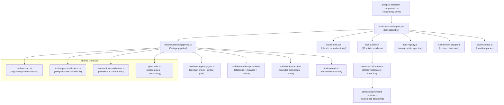

# qmap-ai Architecture

## 1. Overview

`qmap-ai` is the AI-assisted geospatial mapping subsystem of the q-map application (`examples/q-map/`). It exposes **100 tools** to an LLM assistant (via the Vercel AI SDK / OpenAssistant protocol), allowing the model to load cloud data, query datasets, apply spatial analysis operations (clips, joins, overlays, tessellations, H3 aggregation), style map layers, generate charts, and validate results -- all through structured tool calls.

The system is organized around a **5-stage middleware pipeline** that wraps every tool call with argument normalization, policy gating, dedup caching, concurrency control, and result normalization. Tools are grouped into functional categories defined in a declarative manifest, with shared args/response contracts enforced at runtime.

## 2. Architecture Diagram



## 3. Directory Structure

```
src/features/qmap-ai/
├── qmap-ai-assistant-component.tsx   # React component: mounts assistant UI, wires pipeline
├── hooks/
│   └── use-tool-registry.ts          # React hook: assembles tool registry from all builders
├── tool-builders/                    # 31 modules, each exports factory functions
│   ├── discovery.ts                  #   listQMapChartTools
│   ├── runtime-discovery.ts          #   listQMapDatasets, loadCloudMapAndWait
│   ├── dataset.ts                    #   countQMapRows, debugQMapActiveFilters
│   ├── dataset-exploration.ts        #   preview/rank/distinct/search dataset rows
│   ├── dataset-mutations.ts          #   createDatasetFromFilter, merge datasets
│   ├── dataset-derived.ts            #   createDatasetWithNormalizedField, addComputedField
│   ├── dataset-ui.ts                 #   setQMapFieldEqualsFilter, setQMapTooltipFields
│   ├── layer-styling.ts              #   setQMapLayerSolidColor, colorByField, heightByField
│   ├── layer-visibility.ts           #   setQMapLayerVisibility, showOnlyQMapLayer, layerOrder
│   ├── advanced-styling.ts           #   applyQMapStylePreset, colorByThresholds
│   ├── styling-ui.ts                 #   basemap, mapBoundary, fitQMapToDataset, openQMapPanel
│   ├── analytics.ts                  #   describeQMapField, wordCloud, categoryBars, etc.
│   ├── spatial.ts                    #   tassellate + H3 aggregate
│   ├── spatial-analysis.ts           #   spatialJoinByPredicate, bufferAndSummarize
│   ├── spatial-overlays.ts           #   overlay difference/union/intersection/symmetric
│   ├── spatial-statistics.ts         #   autocorrelation, bivariate, hotspot, compositeIndex
│   ├── spatial-interpolation.ts      #   interpolateIDW
│   ├── statistical-analysis.ts       #   regression, classification, correlation
│   ├── constructive-geometry.ts      #   dissolve, simplify, split
│   ├── geometry-editing.ts           #   eraseQMapDatasetByGeometry
│   ├── geometry-materialization.ts   #   clipQMapDatasetByGeometry (1722 LOC)
│   ├── geometry-tool-helpers.ts      #   shared clip/spatial helpers
│   ├── map-materialization.ts        #   clipDatasetByBoundary, drawQMapBoundingBox
│   ├── tessellation-population.ts    #   tassellate/H3 + populateTassellationFromAdminUnits
│   ├── dual-dataset-overlay-factory.ts  # factory for two-input polygon overlay tools
│   ├── h3-paint.ts                   #   paintQMapH3Cell/Cells/Ring
│   ├── orchestration.ts              #   waitForQMapDataset, loadData, saveDataToMap
│   ├── equity-analysis.ts            #   computeQMapEquityIndices
│   ├── exposure-assessment.ts        #   assessPopulationExposure
│   ├── regulatory-compliance.ts      #   listRegulatoryThresholds, checkRegulatoryCompliance
│   └── use-tool-execution.ts         #   shared React hook for tool component execution
├── cloud-tools.tsx                   # Cloud provider + q-cumber query tool factories (3358 LOC)
├── middleware/
│   ├── tool-pipeline.ts              # 5-stage pipeline orchestrator
│   ├── policy-gate.ts                # Stage 2: contract + phase gate + unknown arg rejection
│   ├── dedup-cache.ts                # Stage 3: stateless/mutation/non-actionable caches
│   ├── cache.ts                      # Bounded collections, AsyncMutex, mutation idempotency
│   └── schema-preprocess.ts          # Stage 1: Zod preprocess wiring
├── context/
│   ├── tool-context.ts               # QMapToolContext interface (22 sub-groups, 260 LOC)
│   └── tool-context-provider.ts      # Runtime builder: wires Redux + kepler deps into context
├── services/
│   ├── execution-tracking.ts         # Barrel: post-validation + component runtime + trace
│   ├── post-validation.ts            # Mutation tool set, dataset name resolution
│   ├── tool-component-runtime.ts     # Skip/complete guards for React tool components
│   ├── execution-trace.ts            # Invocation summaries, stats, text analysis
│   └── qcumber-api.ts                # q-cumber HTTP proxy client
├── utils/
│   ├── dataset-resolve.ts            # Dataset resolution, lineage, field resolution
│   ├── dataset-metadata.ts           # Color, layer queries, field classification
│   └── geometry-ops.ts               # Async chunking, geometry, bounds, coordinate ops
├── tool-contract.ts                  # Loads + normalizes qmap-tool-contracts.json
├── tool-args-normalization.ts        # Zod preprocess: filter alias + dataset ref normalization
├── tool-result-normalization.ts      # Result envelope wrapping, dedup eligibility
├── guardrails.ts                     # Phase gates, concurrency classification, policy text
├── tool-registry.ts                  # Category introspection tools (listToolCategories)
├── tool-groups.ts                    # Static tool group builder
├── runtime-tool-groups.ts            # Custom chart tool states + runtime group builder
├── tool-manifest.ts                  # Parses tool-manifest.json
├── tool-manifest.json                # Declarative: 100 tools in 11 categories
├── tool-schema-utils.ts              # Zod schemas, type definitions, palette normalization
├── tool-shim.ts                      # extendedTool factory (thin wrapper over AI SDK tool)
├── mcp-client.ts                     # MCP (Model Context Protocol) bridge client
├── system-prompt.ts                  # Dynamic system prompt builder
├── context-header.ts                 # x-qmap-context HTTP header injection
├── mode-policy.ts                    # AI mode tool filtering (balanced/intent/research)
├── dataset-utils.ts                  # Barrel re-export for utils/*
├── dataset-upsert.ts                 # Dataset creation + upsert logic
├── geometry-ops.ts                   # Barrel re-export for utils/geometry-ops
├── merge-utils.ts                    # Dataset merge field definitions + geometry readiness
├── numeric-analysis.ts               # Numeric field summarization, thresholds, normalization
├── style-presets.ts                  # Named style presets for thematic maps
├── chart-tools.ts                    # Chart tool state management
├── actions.ts                        # Redux actions for qmap-ai state
├── reducer.ts                        # Redux reducer for qmap-ai slice
├── control.tsx                       # AI panel toggle control
├── panel.tsx                         # AI assistant panel wrapper
└── data/                             # Static data files
```

## 4. Tool Lifecycle

A tool call goes through 6 stages from registration to result delivery:

### Stage 0: Registration
- Tool builders in `tool-builders/*` call `extendedTool()` (from `tool-shim.ts`) with a Zod schema, description, and `execute` function.
- `hooks/use-tool-registry.ts` assembles all tool builders, passing each a `QMapToolContext`.
- The assembled registry is passed to `wrapToolsWithPipeline()`.

### Stage 1: Preprocess (arg normalization)
- Each tool's Zod schema may include `z.preprocess(preprocessFlatFilterToolArgs, ...)` to fix LLM hallucinations (e.g., `{filters: [{field, op, value}]}` flattened to `{fieldName, operator, value}`).
- `normalizeQMapToolExecuteArgs()` resolves dataset name aliases and fills fallback dataset refs.

### Stage 2: Policy Gate
- `policy-gate.ts` checks: (a) tool has a registered contract in `qmap-tool-contracts.json`, (b) no unknown arg keys for strict-schema tools, (c) external `shouldAllowTool` callback (mode policy, phase gate).
- If blocked, returns an immediate failure result with `gateType` metadata.

### Stage 3: Dedup Cache
- `dedup-cache.ts` checks three caches: stateless tool call cache (e.g., repeated `listQMapDatasets`), mutation idempotency cache (e.g., repeated `clipQMapDatasetByGeometry` with identical args), and non-actionable failure cache.
- Cache hits return the stored result without re-executing.

### Stage 4: Execute
- Concurrency classification (`guardrails.ts`): `read` tools run in parallel, `mutation` tools serialize through an `AsyncMutex`, `validation` tools have their own path.
- Circuit breakers: max 3 calls per tool per turn, max 15 total tool calls per turn, max 3 tools per single LLM response batch.
- Auto-retry: if a tool result carries `retryWithTool`, the pipeline can re-dispatch.

### Stage 5: Postprocess
- `normalizeToolResult()` wraps every result in a `QMapToolResultEnvelope` with schema version, success/failure, details, warnings, blocking errors, and produced dataset refs.
- Caches are updated with the new result.
- Dataset lineage is tracked (new dataset refs are registered for downstream tools).
- Phase metadata is attached for the turn execution state machine.

## 5. How to Add a New Tool

1. **Create a tool builder** in `tool-builders/`. Export a factory function that receives `QMapToolContext` and returns a tool definition via `extendedTool()`. Define a Zod schema for args.

2. **Add to `runtime-tool-groups.ts`** (or `tool-groups.ts`). Include the tool name in the appropriate input type and wire the factory call.

3. **Wire in `hooks/use-tool-registry.ts`**. Import the factory, call it with the context, and include the result in the assembled registry object.

4. **Add a contract entry** in `artifacts/tool-contracts/qmap-tool-contracts.json` (frontend) and `backends/q-assistant/src/q_assistant/qmap-tool-contracts.json` (backend mirror). The entry must declare:
   - `categories`: array of category keys from `tool-manifest.json`
   - `flags`: `{mutatesDataset, discovery, bridgeOperation}`
   - `argsSchema`: JSON Schema for the tool's arguments (properties, required, additionalProperties)
   - `responseContract`: expected response shape (properties, required, allowAdditionalProperties)

5. **Add a manifest entry** in `tool-manifest.json`. Add the tool name to the appropriate category's `tools` array. If it should be in the base allowlist, add it to `groups.baseAllowlist`.

6. **Add an eval case** in `tests/ai-eval/cases.functional.json`. Define a user prompt and expected tool call(s) so the AI evaluation harness covers the new tool.

7. **Run audits** to verify coverage:
   ```bash
   # Ensure every manifest tool has a contract entry
   node scripts/tool-coverage-audit.mjs

   # Ensure contract schemas match actual Zod schemas
   node scripts/tool-contract-audit.mjs

   # Cross-check eval matrix coverage
   node scripts/ai-matrix-audit.mjs
   ```

## 6. QMapToolContext

`QMapToolContext` (defined in `context/tool-context.ts`) is the single dependency-injection interface shared by all tool builder factories. It replaces the 15-25 ad-hoc parameters previously threaded through each factory.

The interface is organized into **22 sub-groups**:

| Group | Purpose |
|---|---|
| Runtime state | `dispatch`, `getCurrentVisState`, `getCurrentUiState`, `assistantBaseUrl`, `visState`, `aiAssistant`, `activeMode` |
| Refs | `lastRankContextRef` |
| Dataset resolution & utilities | `resolveDatasetByName`, `resolveDatasetFieldName`, `resolveGeojsonFieldName`, `resolveH3FieldName`, `getDatasetIndexes`, `getFilteredDatasetIndexes`, etc. |
| Numeric analysis | `summarizeNumericField`, `computeThresholdsByStrategy`, `inferDatasetH3Resolution`, etc. |
| Color & style utilities | `parseHexColor`, `ensureColorRange`, `buildLinearHexRange`, `getNamedPalette`, etc. |
| Geometry utilities | `geometryToBbox`, `toTurfPolygonFeature`, `turfIntersectSafe`, `reprojectGeoJsonLike`, etc. |
| Merge utilities | `normalizeMergeGeometryMode`, `buildMergeFieldDefinitions`, etc. |
| Dataset upsert | `upsertDerivedDatasetRows`, `upsertIntermediateDataset`, `upsertTassellationDataset`, etc. |
| Tool runtime helpers | `makeExecutionKey`, `shouldUseLoadingIndicator`, `rememberExecutedToolComponentKey`, etc. |
| Field classification | `isLevelLikeField`, `isPopulationLikeField`, `isCategoricalJoinField`, etc. |
| MCP / Cloud | `callMcpToolParsed`, `normalizeCloudMapProvider`, `getQMapProvider` |
| Zod schemas | `QMAP_SORT_DIRECTION_SCHEMA`, `QMAP_COLOR_SCALE_MODE_SCHEMA`, `qMapPaletteSchema`, etc. |
| Third-party: Turf | `turfArea`, `turfBooleanContains`, `turfBuffer`, `turfCentroid`, `turfDistance` |
| Third-party: H3 | `latLngToCell`, `gridDistance`, `getResolution`, `isValidCell`, `gridDisk` |
| Third-party: proj4 | `proj4Transform` |
| Workers | `runH3Job`, `runReprojectJob`, `runClipRowsJob`, `runZonalStatsJob`, etc. |
| H3 paint | `getH3PaintDataset`, `readH3PaintRows`, `upsertH3PaintHex` |
| Tool components | `WordCloudToolComponent`, `CategoryBarsToolComponent` |
| Kepler actions | `wrapTo`, `addDataToMap`, `replaceDataInMap`, `fitBounds`, etc. |
| Kepler constants | `ALL_FIELD_TYPES` |
| Config constants | `QMAP_DEFAULT_CHUNK_SIZE`, `QMAP_AUTO_HIDE_SOURCE_LAYERS`, etc. |
| Inter-tool dependencies | `clipQMapDatasetByGeometry`, `setQMapLayerColorByThresholds` (populated during registry build) |

**Extending QMapToolContext**: Add a new property to the interface in `context/tool-context.ts`, then wire the value in `context/tool-context-provider.ts`. The interface has `[key: string]: any` for forward compatibility, but explicitly typed properties are preferred.

## 7. Cloud Tools and Provider Routing

Cloud tools handle external data loading via a 3-layer routing chain:

```
Frontend (cloud-tools.tsx)
  └─ q-assistant backend (HTTP proxy at /api/...)
       └─ q-cumber backend (data catalog + query engine)
```

**Provider types**:
- `q-storage-backend`: Cloud map storage (save/load full map configurations)
- `q-cumber-backend`: Data catalog with query capabilities (territorial units, datasets, spatial queries)

**Cloud tool categories**:
- `listQCumberProviders` / `listQCumberDatasets` / `getQCumberDatasetHelp`: Catalog discovery
- `queryQCumberDataset` / `queryQCumberTerritorialUnits` / `queryQCumberDatasetSpatial`: Data queries with automatic `loadToMap` for result materialization
- `loadQMapCloudMap` / `loadCloudMapAndWait`: Load saved cloud maps
- `saveDataToMap`: Persist current map state

The q-cumber API client (`services/qcumber-api.ts`) handles HTTP proxy routing, timeout management, and response normalization. Query tools that produce datasets are classified as mutations in `guardrails.ts` (via `QCUMBER_QUERY_MUTATION_TOOLS`) because `loadToMap=true` creates new datasets as a side effect.
